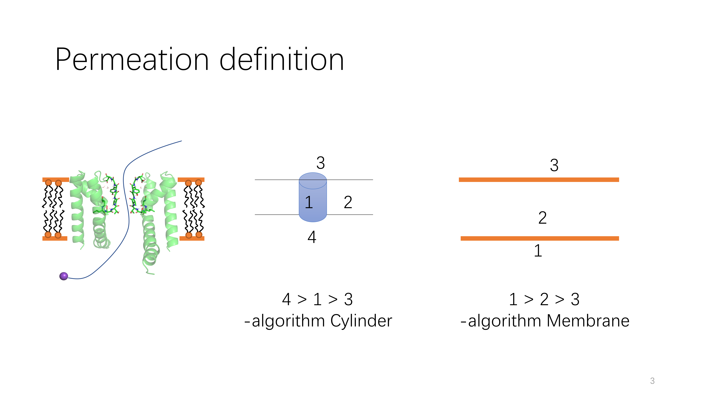

# 044-ion-count
tools for counting ion permeation

## 
mdtraj>=1.9.6 # 1.9.4 won't work
```bash
cd ./test/03-find_SF_from_PDB/04-NaK2K-more/
../../../count_ion.py -K POT -algorithm Membrane -pdb em.pdb -xtc fix_atom_c_kpro.xtc > test_mem.out
../../../count_ion.py -K POT -pdb em.pdb -xtc fix_atom_c_kpro.xtc -cylinderTop "747 2237 3727 5217" -cylinderBot "696 2186 3676 5166" > test_Cyl.out
```
